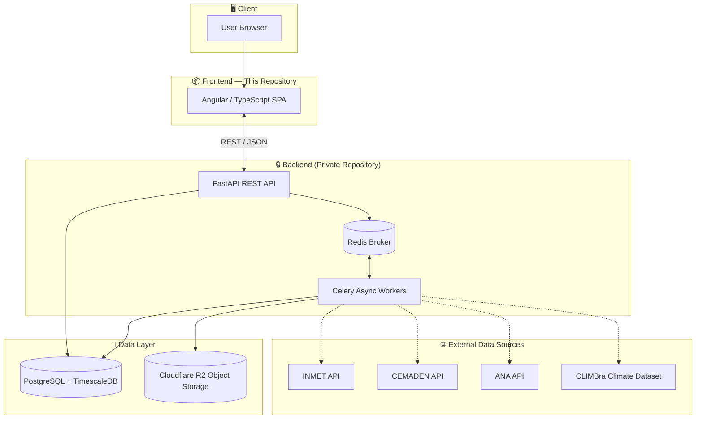
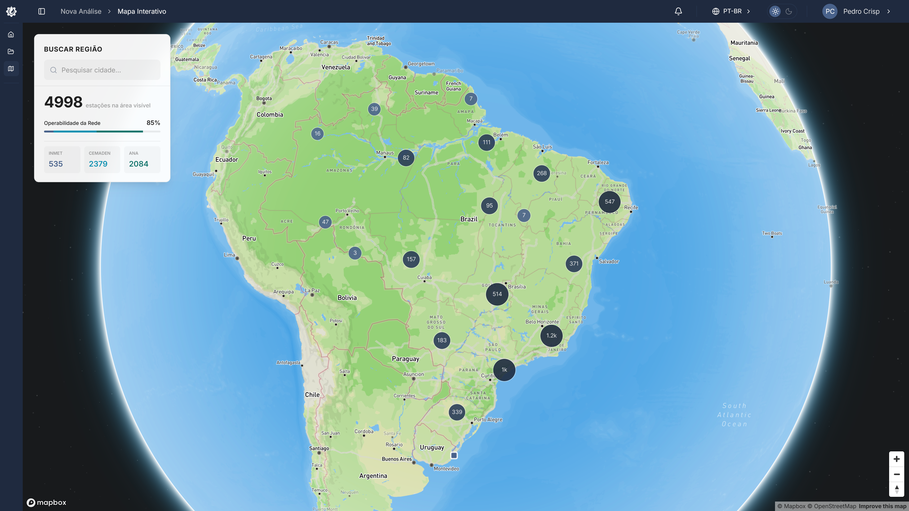
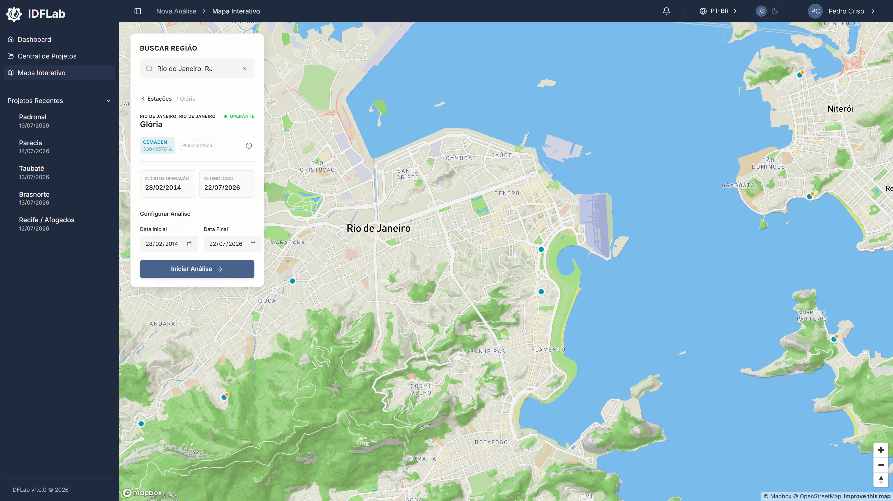

# 🌧️ IDFLab — Frontend

Web platform for automated generation of rainfall Intensity-Duration-Frequency (IDF) curves, with support for future climate scenarios. **This repository contains only the frontend application** (Angular / TypeScript).

---

## 📖 Overview

IDF curves are the standard tool hydraulic engineers use to size drainage systems, culverts, and detention reservoirs. In Brazil, generating them has historically depended on manual, hardcoded scripts or desktop tools limited to static, pre-computed equations that ignore climate change.

IDFLab automates the full pipeline: acquiring rainfall data from government APIs, filling gaps in incomplete time series with machine learning, fitting extreme value distributions, and projecting future IDF curves from climate models, all through a web interface that requires no programming knowledge from the end user.

The project started as a FAPEMIG-funded scientific initiation and is now a Computer Engineering capstone project (TCC) at UNIFEI. **TCC01 was approved with the highest grade**; final defense (TCC02) is scheduled for December 2026.

---

## 🏗️ System Architecture

The platform is split into a public **frontend** (this repository) and a private **backend**. The diagram below documents the full system design to demonstrate end-to-end ownership of the architecture, even though the backend code itself isn't published.

**Why this design:**

- Frontend and backend communicate exclusively via REST, keeping the client fully decoupled from processing logic.
- Data acquisition, gap-filling, and statistical fitting are CPU/IO-heavy and run as async jobs (Celery + Redis) instead of blocking HTTP requests, keeping the UI responsive.
- Rainfall time series (millions of chronologically ordered records) are stored in PostgreSQL with the TimescaleDB extension for efficient range queries.
- Large climate datasets and exported artifacts are stored in object storage (Cloudflare R2) rather than the relational database.

> **Scope note:** The underlying statistical and hydrological methods (data acquisition, gap-filling, disaggregation, extreme value modeling) are openly published in [Automatic-IDF-Graphs](https://github.com/plcrisp/Automatic-IDF-Graphs), the research library this platform builds on. What stays private here is the **productized web platform** wrapped around that engine (async orchestration (FastAPI + Celery/Redis), multi-user project management, database schema, and infrastructure) the layer that turns a research library into a deployable product.

---

## 🖥️ What This Repository Implements

- **Interactive map** for searching and selecting rainfall gauge stations across Brazil, with marker clustering by region and filtering by source (INMET, CEMADEN, ANA).
- **Station detail panels** showing operational status, source, station code, and available date range.
- **Analysis configuration flow**, letting users define a date range and trigger a new analysis run against the backend.
- **Project workspace**, with a dashboard of recent projects and a hub for managing and exporting past analyses.
- **Result visualizations** for time series, histograms, and IDF curves returned by the API.
- **Async job feedback**, reflecting backend processing status (data acquisition, gap-filling, statistical fitting) via notifications without blocking the UI.
- **Internationalization and theming**, with language switching and light/dark mode.

This repository contains no data-processing logic, all computation happens server-side and is consumed exclusively through the REST API.

---

## 🛠️ Tech Stack

**Frontend (this repository)**

- Angular + TypeScript
- Spartan — Angular UI kit (shadcn-inspired, built on Angular CDK)
- Mapbox GL — interactive geospatial station search
- Apache ECharts — time series, histograms, and IDF curve rendering

**Backend & infrastructure (private repository)**

- FastAPI (Python), Celery + Redis for async task orchestration
- PostgreSQL + TimescaleDB, Cloudflare R2 for object storage
- Random Forest for time-series gap-filling, integrated with INMET/CEMADEN/ANA APIs and the CLIMBra climate dataset

---

## 📸 Screenshots

  

<em>Interactive map - stations clustered by region, with live counts per data source (INMET, CEMADEN, ANA).</em>

 

  

<em>Station selected - operational status, source, and available date range before configuring an analysis.</em>

---

## 👤 Author

**Pedro Lucas Crisp** — Computer Engineering student, UNIFEI
[LinkedIn](https://linkedin.com/in/pedrolcrisp) · [GitHub](https://github.com/plcrisp) · pedrolcrisp@gmail.com

---

## 📄 License

All rights reserved. This repository is made public strictly for portfolio and evaluation purposes. No part of this source code may be copied, modified, distributed, or used, in whole or in part, without explicit written permission from the author.

© 2026 Pedro Lucas Crisp.
